## 基础
##### 基础设施的迭代
* IAAS 基础设施是一个服务
> 可以理解为 IAAS 是一个基础设施的服务，提供了基础设施的服务，比如虚拟机，网络，存储等等，比如基于OpenStack，云服务器，云硬盘，云数据库等等。
* PAAS 平台是一个服务
> 可以理解为 PAAS 是一个平台的服务，提供了平台的服务，比如开发平台，运行平台，测试平台等等，比如Kubernetes,Swarm,Apache Mesos等等。
* SAAS 软件是一个服务
> 租户隔离共用一个软件

##### kubernetes优势
* 服务发现和负载均衡
* 存储编排（添加任何本地或云存储系统）
* 自动部署和回滚
* 自动分配CPU和内存 -弹性伸缩
* 自我修复
* Secret和配置管理
* 大型规模的支持
* 开源

### Pod概念
Pod是一个逻辑概念，是一组容器的集合，是最小调度单位

一个Pod内的容器与Pause容器共享名字空间（Network，PID，IPC），**Pause**容器是一个占位容器，不做任何事情，只是为了让Pod内的其他容器能够共享网络和存储卷等资源。

### Kubernetes网络模型

#### CNI (Container Network Interface)
CNI是一个规范，定义了容器网络的接口，Kubernetes使用CNI来实现容器网络。

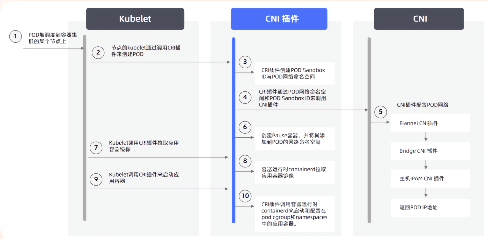
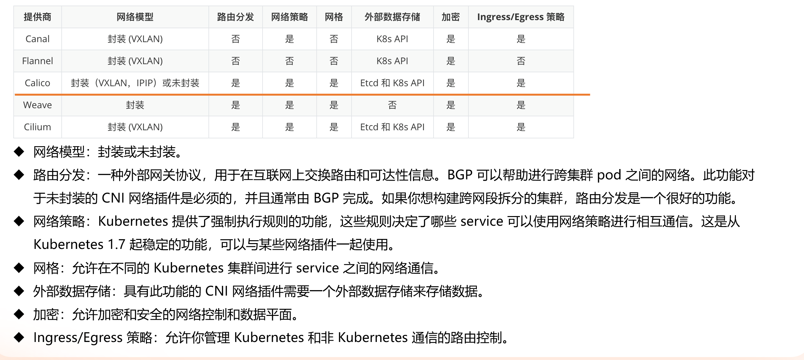  
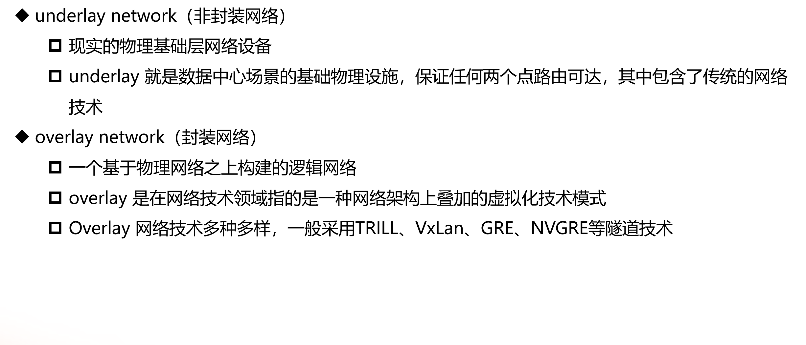
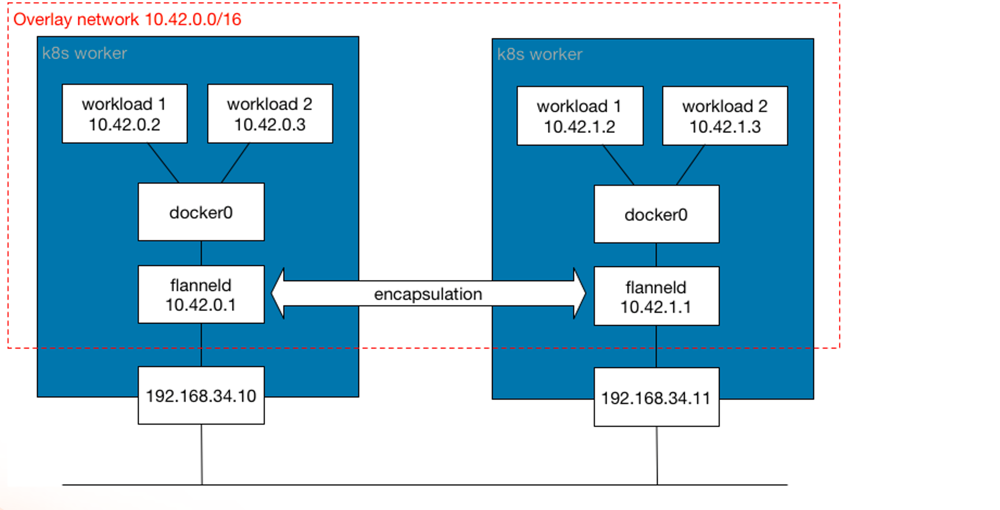
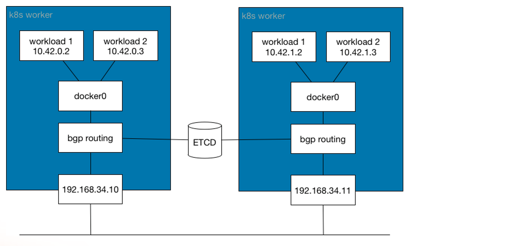

#### calico架构
##### calico架构图
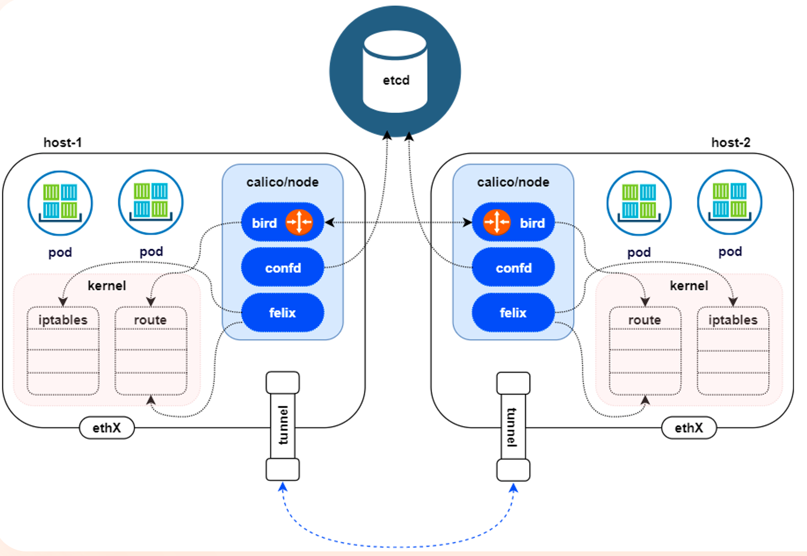
1.Felix 
* 管理网络接口
* 编写路由
* 编写ACL（访问控制列表）
* 报告状态

2.bird
* BGP Client将通过BGP协议广播告诉剩余calico节点，从而实行网络互通

3.confd
* 通过监听etcd以了解BGP配置和全局默认值的更改，Confd根据ETCD中的数据的更新，动态生成BIRD配置文件，当配置文件更改时，confd触发BIRD重新加载新文件

##### calico网络模型

###### VXLAN
VXLAN 即Virtual eXtensible Local Area Network，是一种虚拟化技术，用于在二层网络上建立逻辑二层网络，从而实现跨主机的二层网络通信。
是Linux本身支持的一种网络虚拟化技术，VXLAN可以完全在内核态实现封装和解封装，从而通过隧道机制，构建出覆盖网络


数据包封包：在vxlan设备上将pod发来的数据包源、目的mac替换为本机vxlan网卡和对端节点vxlan网卡的mac，外层udp目的ip地址根据路由和对端vxlan的mac查fdb表获取

优势：只要k8s三层节点互通，可以跨网段，对主机网关路由没有特殊要求，各个node节点通过vxlan设备实现基于三层的二层互通

> 基于三层的“二层”通信，即vxlan包封装在udp数据包中，要求udp在k8s节点间三层可达；二层即vxlan封包的源mac地址和目的mac地址是自己的vxlan设备mac和对端vxlan设备mac实现通讯

缺点：封包和解包会存在一定的性能损耗

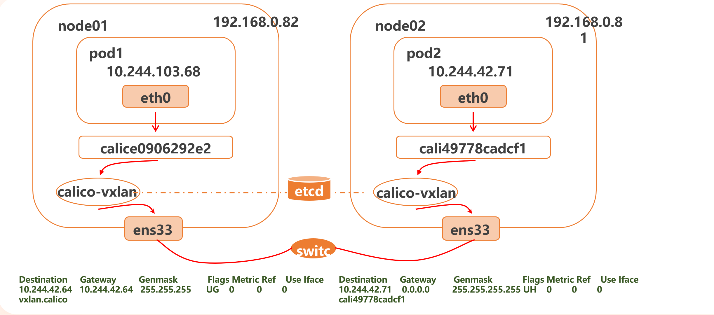

vxlan底层封装模型
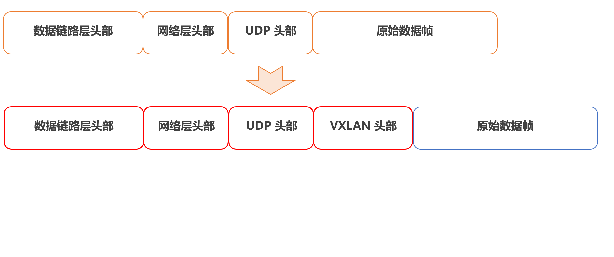

###### 在calico中使用vxlan
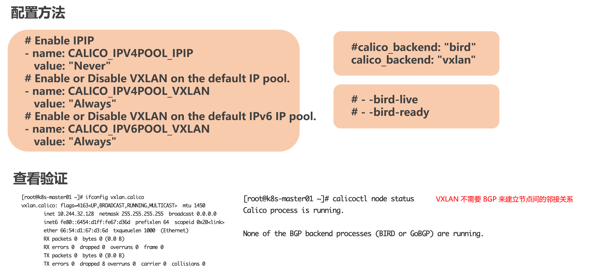

##### IPIP

数据包封包：在tunl0设备上将pod发来的数据包源、目的mac替换为本机tunl0网卡和对端节点tunl0网卡的mac，外层数据包目的根据路由得到

解包和封包会存在一定性能损耗

* Linux原生支持
* IPIP隧道的工作原理是将源主机的IP数据包封装在一个新的数据包中，新的IP数据包的目的地址是隧道的另一端，在隧道的另一端，接受方将解封原始IP数据包，并将其传递给目的主机

> IPIP隧道可以在不同网络之间建立连接，例如在IPv4网络和IPv6网络之间建立连接，或者在不同的IPv4网络之间建立连接

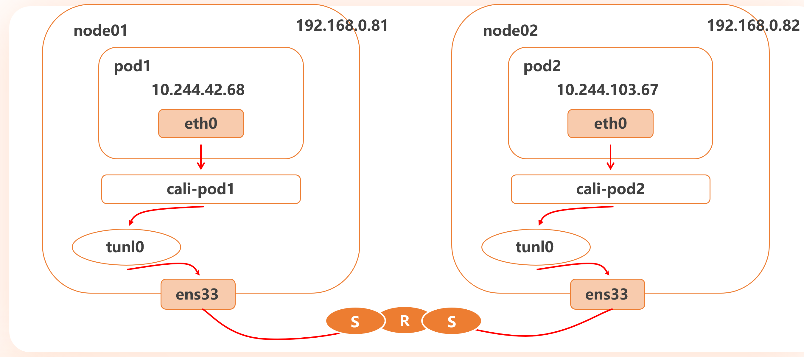
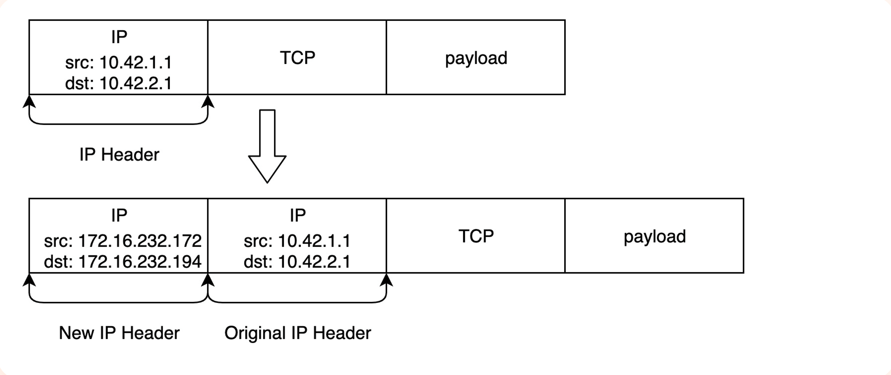
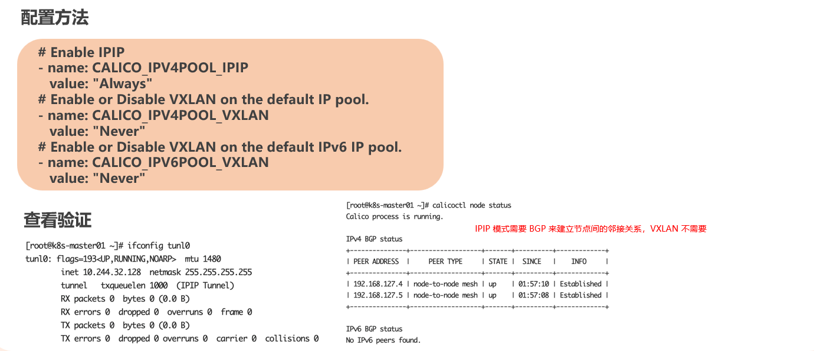

##### BGP
边界网关协议（Border Gateway Protocol，BGP）是互联网上一个核心的去中心化自治路由协议，它通过维护IP路由表或“前缀”表来实现自治系统之间的可达性，属于矢量路由协议

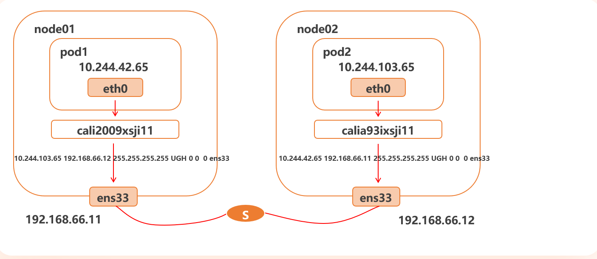

BGP
* 数据包封包：不需要进行数据包封包
* 优点： 不用封包解包，通过BGP协议可实现pod网络在主机间的三层可达
* 缺点：跨网段时，配置较为复杂网络要求高，主机网关路由也需要充当BGP Speaker

配置方法
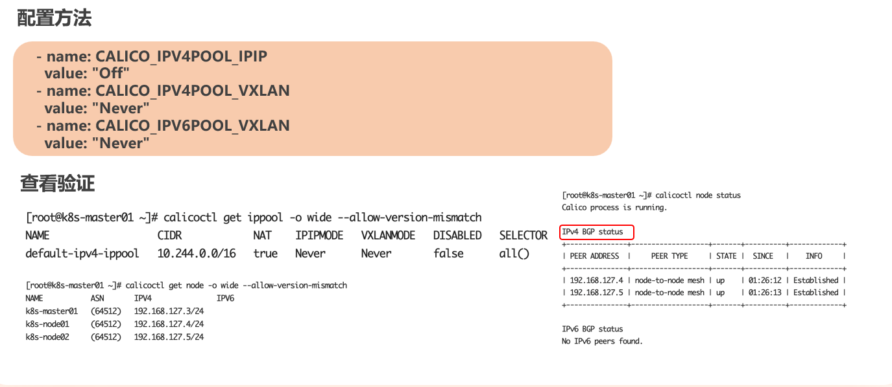

## Kubernetes安装

### 安装方式
#### kubeadm
组件通过容器化方式运行

优势
* 简单
* 自愈

缺点
* 无法自定义

#### 二进制安装
组件变成系统进程的方式运行

优点
* 能够更灵活的安装集群

## K8s资源清单

### 资源类别
* 名称空间级别
    * 工作负载型资源：Pod，ReplicaSet，Deployment
    * 服务发现及负债均衡型资源: Service,Ingress...
    * 配置与存储型资源: Volume,CSI
    * 特殊类型的存储卷: ConfigMap,Secret
* 集群级资源
    * Namespace,Node,ClusterRole,ClusterRoleBinding
* 元数据型资源
    * HPA,PodTemplate,LimitRange

### 资源清单结构
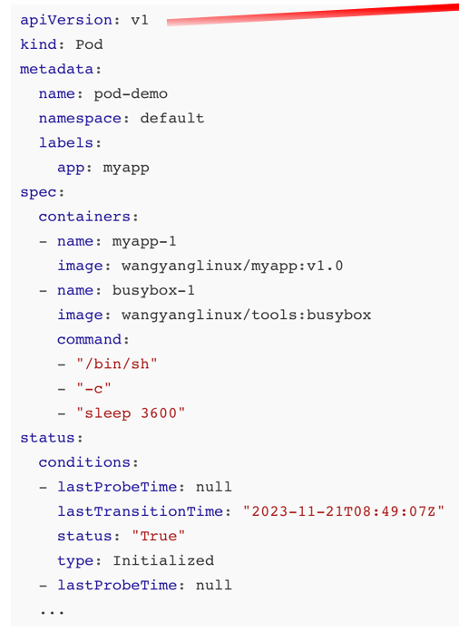

* apiVersion: 资源类型的API版本
* kind: 资源类型
* metadata: 元数据
    * name: 资源名称
    * namespace: 资源所在的名称空间,默认为default
    * labels: 资源标签
* spec: 资源规格（期望）
    * 
* status: 资源状态（实际）（由K8s管理）

`kubectl apiversions` 查看支持的API版本

`kubectl explain [资源类型]` 查看资源清单结构
> 还可以查询子对象，如`kubectl explain pod.spec.containers`

创建一个pod
`kubectl create -f demo.yaml`

查看pod
`kubectl get pods`

删除一个pod
`kubectl delete -f demo.yaml`

容器排错

查看pod详细信息
`kubectl describe pod pod-demo-1`
```shell
Name:             pod-demo-1
Namespace:        default
Priority:         0
Service Account:  default
Node:             k8sn1/192.168.17.12
Start Time:       Fri, 24 Jan 2025 10:53:07 +0800
Labels:           app=myapp
Annotations:      cni.projectcalico.org/containerID: 29e078e4c8430c6c13e3dd591c9c75ecbc41a3d1a8e80b0266d972ef4ede5bb2
                  cni.projectcalico.org/podIP: 10.244.203.0/32
                  cni.projectcalico.org/podIPs: 10.244.203.0/32
Status:           Pending
IP:               
IPs:              <none>
Containers:
  myapp-1:
    Container ID:   
    Image:          wangyanglinux/myapp:v1.0
    Image ID:       
    Port:           <none>
    Host Port:      <none>
    State:          Waiting
      Reason:       ContainerCreating
    Ready:          False
    Restart Count:  0
    Environment:    <none>
    Mounts:
      /var/run/secrets/kubernetes.io/serviceaccount from kube-api-access-fdbt2 (ro)
  myapp-2:
    Container ID:   
    Image:          wangyanglinux/myapp:v2.0
    Image ID:       
    Port:           <none>
    Host Port:      <none>
    State:          Waiting
      Reason:       ContainerCreating
    Ready:          False
    Restart Count:  0
    Environment:    <none>
    Mounts:
      /var/run/secrets/kubernetes.io/serviceaccount from kube-api-access-fdbt2 (ro)
Conditions:
  Type                        Status
  PodReadyToStartContainers   False 
  Initialized                 True 
  Ready                       False 
  ContainersReady             False 
  PodScheduled                True 
Volumes:
  kube-api-access-fdbt2:
    Type:                    Projected (a volume that contains injected data from multiple sources)
    TokenExpirationSeconds:  3607
    ConfigMapName:           kube-root-ca.crt
    ConfigMapOptional:       <nil>
    DownwardAPI:             true
QoS Class:                   BestEffort
Node-Selectors:              <none>
Tolerations:                 node.kubernetes.io/not-ready:NoExecute op=Exists for 300s
                             node.kubernetes.io/unreachable:NoExecute op=Exists for 300s
Events:
  Type     Reason     Age                    From               Message
  ----     ------     ----                   ----               -------
  Normal   Scheduled  5m28s                  default-scheduler  Successfully assigned default/pod-demo-1 to k8sn1
  Normal   Pulling    5m27s                  kubelet            Pulling image "wangyanglinux/myapp:v1.0"
  Normal   Pulled     4m22s                  kubelet            Successfully pulled image "wangyanglinux/myapp:v1.0" in 1m4.799s (1m4.799s including waiting)
  Normal   Created    4m22s                  kubelet            Created container myapp-1
  Normal   Started    4m22s                  kubelet            Started container myapp-1
  Normal   Pulling    4m22s                  kubelet            Pulling image "wangyanglinux/myapp:v2.0"
  Normal   Pulled     4m13s                  kubelet            Successfully pulled image "wangyanglinux/myapp:v2.0" in 8.825s (8.825s including waiting)
  Normal   Created    3m25s (x4 over 4m13s)  kubelet            Created container myapp-2
  Normal   Started    3m25s (x4 over 4m13s)  kubelet            Started container myapp-2
  Normal   Pulled     2m29s (x4 over 4m10s)  kubelet            Container image "wangyanglinux/myapp:v2.0" already present on machine
  Warning  BackOff    26s (x17 over 4m7s)    kubelet            Back-off restarting failed container myapp-2 in pod pod-demo-1_default(505b2c03-871d-44f0-ad21-018fff0f3a3b)
```

主要看Events: k8s调度的过程事件

`kubectl logs pod-demo-1 -c myapp-1` 查看容器日志

### Pod的生命周期
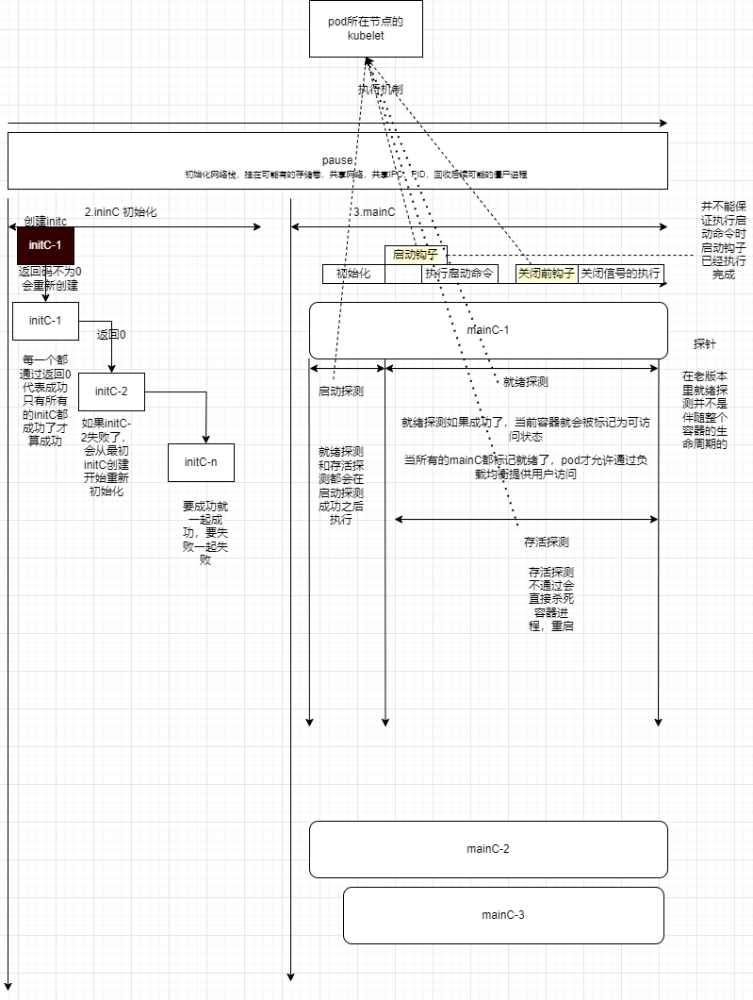

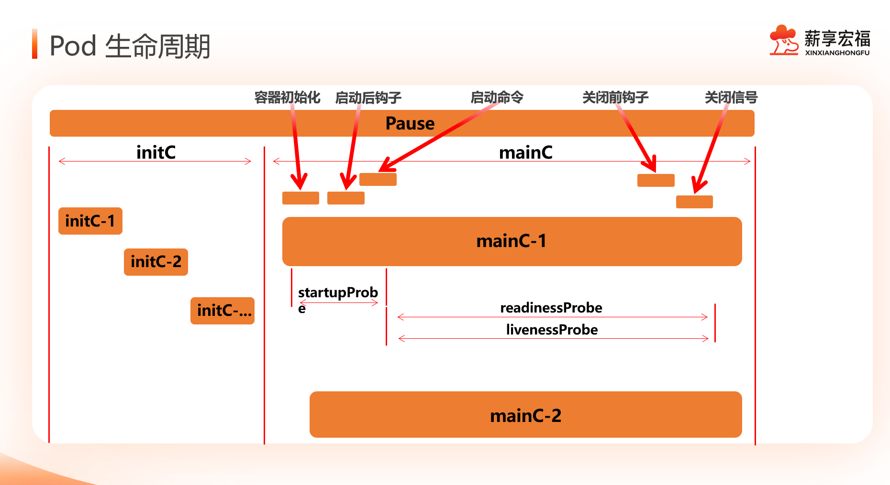

#### initC
init容器与普通的容器非常像，除了以下两点
* init容器总是运行到成功完成为止
* 每个init容器都必须在下一个init容器启动之前成功完成

> 如果Pod的init容器失败，k8s会不断的重启该Pod，知道init容器成功为止，**然而如果Pod对应的restartPolicy为Never，它不会重新启动**

##### 检测initC的阻塞性
```yaml
apiVersion: v1
kind: Pod
metadata:
  name: initc-1
  labels:
    app: initc
spec:
  containers:
    - name: myapp-container
      image: wangyanglinux/tools:busbox
      command: ['sh', '-c', 'echo The app is running! && sleep 3600']
  initContainers:
    - name: init-myservice
      image: wangyanglinux/tools:busybox
      command: ['sh', '-c', 'until nslookup myservice; do echo waiting for myservice; sleep 2; done;']
      
    - name: init-mydb
      image: wangyanglinux/tools:busbox
      command: ['sh', '-c', 'until nslookup mydb; do echo waiting for mydb; sleep 2; done;']
```


