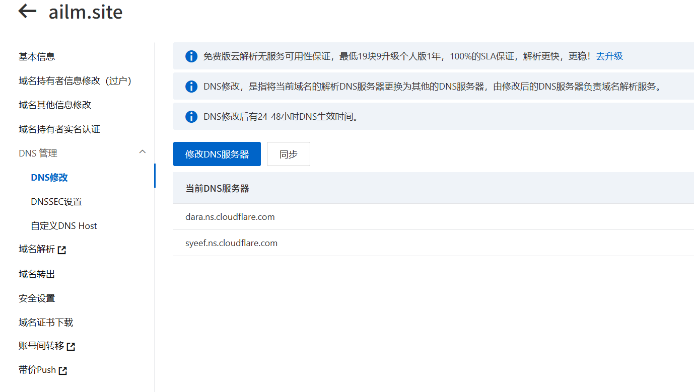
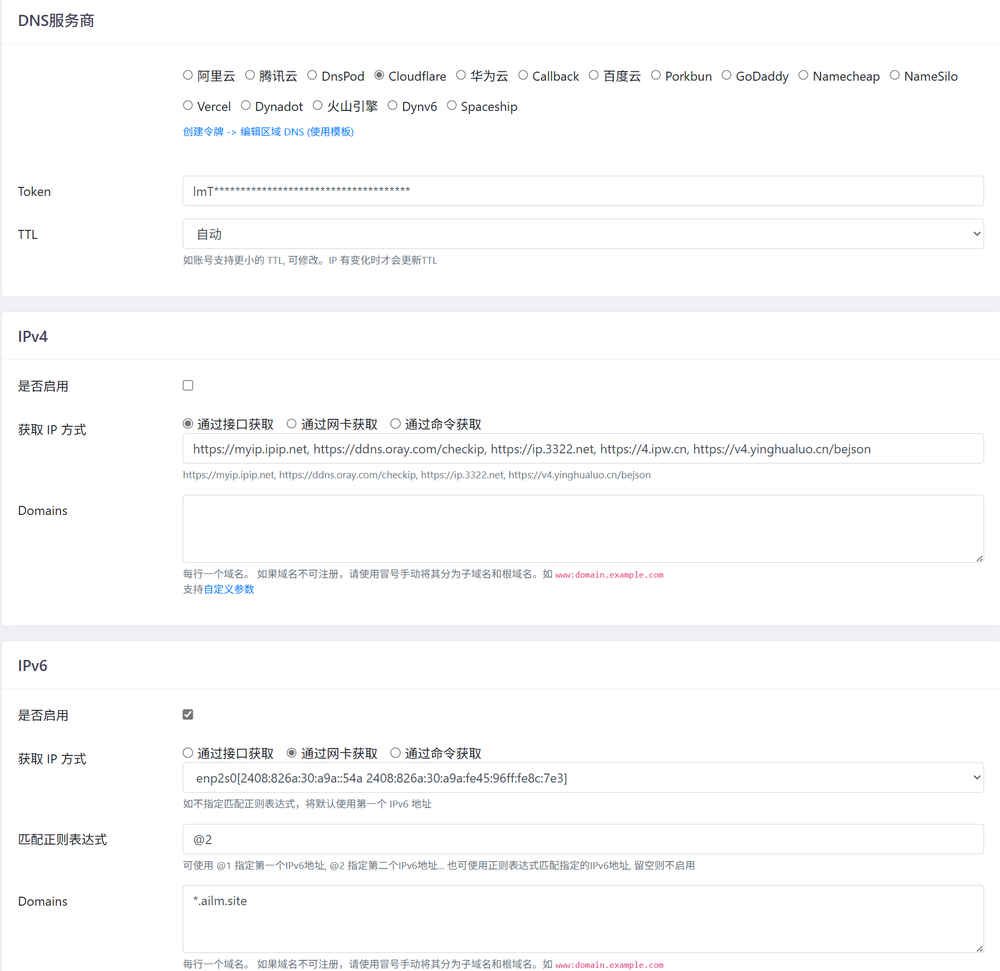

## 前期理论环节
云服务器虽然~~便宜~~方便,但备案以及失去新人优惠后的续费只会带来更多痛苦,于是我使用了家宽加上低功耗电脑建站,随之也遇到了更多问题

- 首先需求是能够公网域名访问,且需要支持ipv4,因为家人也需要使用,一众免费frp直接排除(我要使用自己的域名),自建frp自建vpn排除(我都买服务器了我还建个锤子家宽建站)
- 不考虑云服务器,迁移服务器只会给我带来痛苦

几年前到现在一直在尝试家宽建站,从最初直接

在这个大前提下,应该只能自己电脑通过宽带开启IPv6搭建web服务了,但这里有个重要的风险和其他问题
- 没有固定ip地址
- 家宽是禁止提供web服务的,如果被运营商确认,将面临上门拍照,签保证书的风险,网上能看到网友群晖的后台登录界面都不行
- 经济成本,一台电脑24小时运行的电费可不低,如果家里有群晖这种nas还行,或者买个工控机,10w功率一年才50块钱电费

接下来公布大致方案
准备的东西:
- ~~首先你需要一条宽带~~
- 一台能上网的设备,最好是linux系统或windows系统,手机愿意折腾到arm的linux也无所谓
- cloudflare账号
- 一个域名
- 一台支持ipv6的路由器,并且会配置光猫IPv6(教程网上比较多,只要能实现5g网ping通家宽里获取了ipv6的电脑就行)

你需要一定的知识储备,如果能有完整的知识将会非常轻松理解,当然如果你知道他们相应的作用那也没有问题:
- Linux/Windows *
- Nginx *
- IP协议
- HTTP协议
- DNS协议
- SSL协议

先看效果:使用全球最大的CDN服务商Cloudflare(以下简称cf)做中转和域名解析,通过家里服务器使用DDNS-GO定期监测ipv6地址并更新DNS解析记录,开启cf代理后公网访问域名流量通过cdn再到家宽服务器,隐藏域名解析的源站ip地址,家宽服务器只开启80,443,源站启用mTLS要求客户端提供信任的证书,并且只信任cf的CA签名的证书,这意味者你想通过公网访问你的服务只能通过cf中转,其他人不能得知你的源站ip,就算得知了你的源站ip也无法直接访问


> cf新人指路: 可以发现这里的请求是两个请求了,浏览器请求到cf,cf请求源站,源站返回数据到cf, cf返回数据到浏览器,全程https加密,拒绝裸奔

> 当然,如果你希望你的~~涩涩~~服务不想让其他人能访问,自己又需要公网访问时,也可以在cf中配置来自浏览器的客户端证书要求


由于开启了cf代理,https证书已经由cf自动托管,所以这点也无需任何配置,还可以隔绝机器人脚本


如果不开启代理,只解析DNS的话流量是直接到家的,会暴露源站ip,这可能会有黑客攻击的风险(虽然那点东西不值钱,但是万一被萌新黑客拿来练手把CentOS给你装成Ubuntu了呢),而且后续的安全方案也无法实现


运营商也知道你的域名的话也能直接看到该域名指向了你的家宽ip,但运营商一般不知道你域名,这点问题不是很大


这里的地址是cf服务器节点的地址,源站ip为动态ipv6并且已经隐藏

### 卑鄙的运营商不讲武德
当然运营商是知道你家的ip地址的,他可以直接通过ip访问你的80,443端口来看你有没有提供web服务,这种卑鄙手段我们当然要合理拒绝


这里参考了一位大佬的文章,并在其基础上做了改进,首先浏览器访问域名的证书已经是由cf自动托管了,该证书没有放在源站上,源站上放的证书是来自cf签名的证书这个证书应该是不受浏览器信任的,但cf会信任
,**启用mTLS使源站需要提供信任的客户端证书访问,而客户端证书只信任来自cf节点服务器提供的客户端证书**,大佬原文中是使用防火墙信任cf节点服务器IP,万一cf那边ip变了不好说,其次开启了防火墙等于把自己的路也堵死了,使用mTLS证书更加灵活


> [防止SSL证书泄漏：Nginx 网络安全配置-哔哩哔哩](https://b23.tv/thuXYlp) 


## 痛苦又快乐的折腾环节
我的环境为
- 号称CentOS的平替的[AlmaLinux](https://almalinux.org/zh-hans/)
- Docker部署的[DDNS-GO](https://github.com/jeessy2/ddns-go)
- 包管理工具安装的[Nginx](https://nginx.github.net.cn/)
- 脚本安装的[NginxUI](https://nginxui.com/zh_CN/)

### 打破距离与公网的亲密接触

第一步当然是开启ipv6检查网络连通性,这一步运气不好可能要花很多天甚至玩崩宽带,到时候恢复光猫出厂设置,至少我是这样干过

移动联通电信的开启方法以及各地开启方法可能不一样,这里仅作参考
[普通家庭宽带用户如何正确的开启IPv6网络](https://post.smzdm.com/p/apvnl2r0/)
> 我的环境是光猫桥接,前缀使能(PD),路由器拨号,关闭Ipv6防火墙,Native模式或者SLAAC模式(dhcpv6可能不行,只能提供ipv6上网,不能对外提供访问)

开启IPv6之后重新连接Wifi或者插拔网线或者重启电脑查看ip地址是否是240e或者2408或者2...开头,如果只有fe80那就说明没有获取到地址

做到上面一步,打开Ipv6测试网站测试能通过说明你已经获取到一个ipv6地址并且能正常工作了

但只是内网访问外网,要外网访问内网还需要进一步测试

如果只有一台电脑和手机,可以在手机上下载ping工具,例如`PingTools Pro`,用手机开启5g测试ipv6地址通过后 ping电脑ip

如果无法ping通查看光猫和路由器的ipv6防火墙是不是打开了,关闭防火墙再试试,其他问题自行处理

### 人类拼尽全力也无法记住也只能依靠CV的ipv6地址需要域名来拯救
你需要一个域名,[阿里买](https://wanwang.aliyun.com/)也行,需要转移DNS解析服务器到cf

[登录cf](https://www.cloudflare-cn.com/),在cf导入你的域名,根据cf的提示去设置DNS服务器,阿里买的就去阿里那边设置



一切成功后,将域名解析到你的家庭服务器的ipv6地址,ipv6是AAAA记录

我的二级域名已经用于cf托管的静态博客,所以将三级域名*通配符解析到家庭服务器,这样后面我如果要新增一个网站不用来配置dns解析了,直接到nginx里新增一个就行

使用之前测试的方法ping你的域名,如果ping通域名,那么最困难的时期就度过了

### 安装DDNS-GO,解决动态IP的问题
运营商给你的IP是动态变化的,所以解决方案就是DDNS,家庭服务器[安装DDNS-GO](https://github.com/jeessy2/ddns-go)


去cf生成令牌


配置ddns,由于家宽的ipv4是nat之后的网络,不属于公网,所以不考虑,这里只配置ipv6,获取ip方式建议为通过网卡获取

一般来说会有两个ipv6地址,这里选最长的那个,所以匹配正则表达式我这是`@2`,域名我就使用通配符,

配置完成后点最下面的保存,若无报错即可,之后只要确保DDNS-GO服务一直运行就可以保持域名访问家庭服务器了

### 搭建Web服务

安装nginx,我这为了更方便的管理nginx使用了nginx + nginxUI,nginxUI是独立于nginx外部的服务,nginxUI炸了也不会影响nginx的运行,

防火墙放行80 443端口

安装完成后创建一个网站试试,用文本编辑器创建一个文件随便敲几个字符,保存命名为index.html反正网站目录上,配置完nginx就行

``` 
server {
listen 80;
listen [::]:80;
server_name hello.ailm.site;
root /var/www/html/hello;
index index.html;
}
```

访问域名成功证明已经完成了主要的配置

### 安全生产责任重于泰山

#### 拒绝ip访问
上述步骤已经实现了最基本的家宽建站的功能,回到开头的问题,需要隐藏源站IP,且对外部流量零信任,启用mTLS验证客户端身份,以及使用ip访问到nginx时,nginx默认会将default_server作为响应,如果没有配置default_server则会将配置的第一个server作为default_server响应出去,所以根据b站大佬给出的方案新增一个server,直接拒绝所有或有ip访问


#### 启用cf强大且个人免费的CDN来保护源站

代理状态设置为代理而非仅DNS,这样你解析域名得到的IP是cf节点服务器的ip,并且**支持IPv4和IPv6**,否则你只能通过ipv6访问,并且你需要自己配置ssl证书,以及源站ip无法隐藏

#### 启用 `浏览器 -> cf `  `cf -> 源站`的https


如果你认为数据可以在互联网上裸奔可以选择灵活或者关闭,所有数据都是明文传输,所以遇到见人就偷着乐吧

如果开启了代理这里`浏览器 -> cf `应该已经自动托管了无需配置

`cf -> 源站`你可以在源站使用自己的自动续签工具可以选择完全模式,我直接使用cf来签发个15年的通配符证书,使用完全(严格),因为我后续启用mTLS后源站不接受来自用户浏览器的访问,只接受cf节点的请求,用权威CA签发的没啥用

[cloudflare源站CA](https://developers.cloudflare.com/ssl/origin-configuration/origin-ca/)


点击创建证书,将证书当作你申请下来的ssl证书反在服务器上,nginx配置好就行,**以后所有的站点都可以使用该证书,无需再进行配置**


至此完成了`浏览器 信任 cf`  `cf 信任 源站`

#### ` cf <- 源站 `源站启用mTLS客户端验证
[来自cf的mTLS文档说明](https://developers.cloudflare.com/ssl/origin-configuration/authenticated-origin-pull/explanation/)

cf启用经过身份验证的源服务器拉取


后续cf请求源站时会带上由下面CA签发的证书,你只需在nginx启用强制验证客户端证书并配置cf提供的CA

这里意思是 启用验证客户端证书,[CA证书文件](https://developers.cloudflare.com/ssl/static/authenticated_origin_pull_ca.pem),nginx会用这个CA对客户端提供的证书验证,客户端证书保存在cf那边的

[CA证书下载](https://developers.cloudflare.com/ssl/static/authenticated_origin_pull_ca.pem)

[cf配置mTLS文档](https://developers.cloudflare.com/ssl/origin-configuration/authenticated-origin-pull/set-up/zone-level/)

配置完成后 `浏览器 -> cf`   `cf -> 源站`  `cf <- 源站`  的安全认证已经完成,你的服务现在通过公网访问只能通过浏览器访问到cf再由cf转发到源站,并且隐藏了源站ip,运营商想查也无法查,

> 唯一的方式就是知道你的家宽有入站请求,如果个别地区封锁了80和443,照样可以通过cf配合nginx来避开,除非运营商完全封锁了入站请求

#### 通过公网访问的不对外公开的web服务(可选)
如果你的~~涩涩~~服务需要私密不对外公开,那么同样可以使用上一步的mTLS来控制`浏览器 <- cf`的安全认证,浏览器提供证书供cf验证

在客户端证书中编辑   请选择要启用 mTLS 的主机为你需要配置的域名或者创建mTLS规则,创建证书,安装到设备上,访问网站的时候会自动弹框提示选择证书,若不提供证书无法访问

这步做完之后就实现了`浏览器 - cf - 源站`的绝对访问认证,只要你的证书没有泄露其他人就无法访问你的网站,即使泄露了及时吊销和更换证书即可
 
此功能我并未实践,后续更新