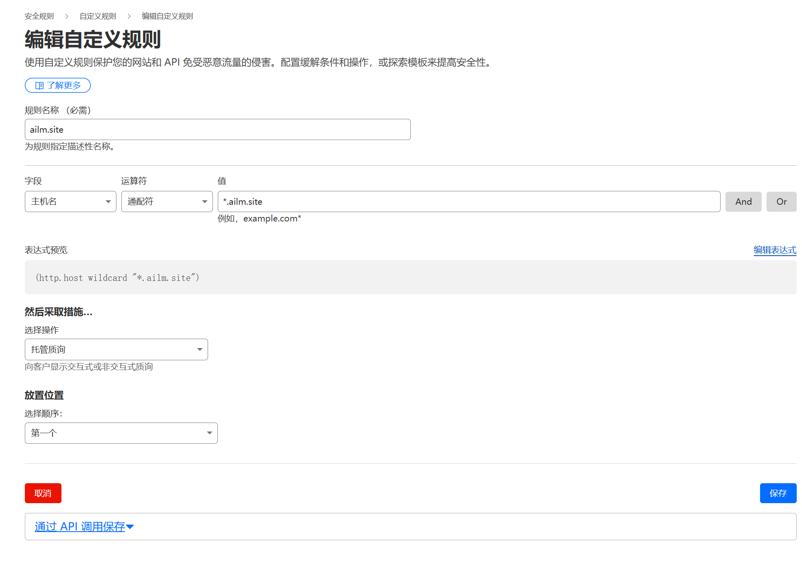

## 前期理论环节

### 需求
云服务器虽然~~便宜~~方便,但备案以及失去新人优惠后的续费只会带来更多痛苦,于是我使用了家宽加上低功耗电脑建站,随之也遇到了更多问题

- 首先需求是能够公网域名访问,且需要支持IPv4,因为家人也需要使用,一众免费frp直接排除(我要使用自己的域名),自建frp自建vpn排除(我都买服务器了我还建个锤子家宽建站)
- 不考虑云服务器,迁移服务器只会给我带来痛苦

几年前到现在一直在尝试家宽建站,从最初直接

在这个大前提下,应该只能自己电脑通过宽带开启IPv6搭建web服务了,但这里有个重要的风险和其他问题
- 没有固定ip地址
- 家宽是禁止提供web服务的,如果被运营商确认,将面临上门拍照,签保证书的风险,网上能看到网友群晖的后台登录界面都不行
- 经济成本,一台电脑24小时运行的电费可不低,如果家里有群晖这种nas还行,或者买个工控机,10w功率一年才50块钱电费

### 效果

使用全球最大的CDN服务商Cloudflare(以下简称CF)做中转和域名解析,通过家里服务器使用DDNS-GO定期监测IPv6地址并更新DNS解析记录,开启CF代理后公网访问域名流量通过cdn再到家宽服务器,隐藏域名解析的源站ip地址,家宽服务器只开启80,443,源站启用mTLS要求客户端提供信任的证书,并且只信任CF的CA签名的证书,这意味者你想通过公网访问你的服务只能通过CF中转,其他人不能得知你的源站ip,就算得知了你的源站ip也无法直接访问


由于开启了CF代理,https证书已经由CF自动托管,所以这点也无需任何配置,还可以隔绝机器人脚本


如果不开启代理,只解析DNS的话流量是直接到家的,会暴露源站ip,这可能会有黑客攻击的风险(虽然那点东西不值钱,但是万一被萌新黑客拿来练手把CentOS给你装成Ubuntu了呢),而且后续的安全方案也无法实现


运营商也知道你的域名的话也能直接看到该域名指向了你的家宽ip,但运营商一般不知道你域名,这点问题不是很大


这里的地址是CF服务器节点的地址,源站ip为动态IPv6并且已经隐藏

### 卑鄙的运营商不讲武德
当然运营商是知道你家的ip地址的,他可以直接通过ip访问你的80,443端口来看你有没有提供web服务,这种卑鄙手段我们当然要合理拒绝


首先浏览器访问域名的证书已经是由CF自动托管了,该证书没有放在源站上,源站上放的证书是来自CF签名的证书这个证书应该是不受浏览器信任的,但CF会信任
,**启用mTLS使源站需要提供信任的客户端证书访问,而客户端证书只信任来自CF节点服务器提供的客户端证书**


## 痛苦又快乐的折腾环节
我的环境为
- 号称CentOS的平替的[AlmaLinux](https://almalinux.org/zh-hans/)
- Docker部署的[DDNS-GO](https://github.com/jeessy2/ddns-go)
- 包管理工具安装的[Nginx](https://nginx.github.net.cn/)
- 脚本安装的[NginxUI](https://nginxui.com/zh_CN/)


准备的东西:
- ~~首先你需要一条宽带~~
- 一台能上网的设备,最好是linux系统或windows系统,手机愿意折腾到arm的linux也无所谓
- cloudflare账号
- 一个域名
- 一台支持IPv6的路由器,并且会配置光猫IPv6(教程网上比较多,只要能实现5g网ping通家宽里获取了IPv6的电脑就行)
- 公网Ipv6支持
> 我的环境是光猫桥接,前缀使能(PD),路由器拨号,关闭Ipv6防火墙,Native模式或者SLAAC模式(DHCPv6可能不行,只能提供IPv6上网,不能对外提供访问)


你需要一定的知识储备,如果能有完整的知识将会非常轻松理解,当然如果你知道他们相应的作用那也没有问题:
- Linux/Windows *
- Nginx *
- IP协议
- HTTP协议
- DNS协议
- SSL协议

### 打破距离与公网的亲密接触

第一步当然是开启IPv6检查网络连通性,这一步运气不好可能要花很多天甚至玩崩宽带,然后恢复光猫出厂设置,至少我是这样干过

我这边恢复光猫出厂设置之后超级管理员就是默认账号密码,只需要记下宽带账号密码就行,不排除你们和我不一样

移动联通电信的开启方法以及各地开启方法可能不一样,这里仅作参考

[普通家庭宽带用户如何正确的开启IPv6网络](https://post.smzdm.com/p/apvnl2r0/)

开启IPv6之后重新连接Wifi或者插拔网线或者重启电脑查看ip地址是否是240e或者2408或者2...开头,如果只有fe80那就说明没有获取到地址


做到上面一步,打开Ipv6测试网站测试能通过说明你已经获取到一个IPv6地址并且能正常工作了

但只是内网访问外网,要外网访问内网还需要进一步测试

如果只有一台电脑和手机,可以在手机上下载ping工具,例如`PingTools Pro`,用手机开启5g测试IPv6地址通过后 ping电脑ip

如果无法ping通查看光猫和路由器的IPv6防火墙是不是打开了,关闭防火墙再试试,其他问题自行处理

### 人类拼尽全力也无法记住只能依靠CV的IPv6地址需要域名来拯救
你需要一个域名,[阿里买](https://wanwang.aliyun.com/)也行,需要转移DNS解析服务器到CF

[登录CF](https://www.cloudflare-cn.com/),在CF导入你的域名,根据CF的提示去设置DNS服务器,阿里买的就去阿里那边设置


一切成功后,将域名解析到你的家庭服务器的IPv6地址,IPv6是AAAA记录


我的二级域名已经用于CF托管的静态博客,所以将三级域名*通配符解析到家庭服务器,这样后面我如果要新增一个网站不用来配置dns解析了,直接到nginx里新增一个就行

使用之前测试的方法ping你的域名,如果ping通域名,那么最困难的时期就度过了

### 安装DDNS-GO,解决动态IP的问题
运营商给你的IP是动态变化的,所以解决方案就是DDNS,家庭服务器[安装DDNS-GO](https://github.com/jeessy2/ddns-go)


去CF生成令牌


配置ddns,由于家宽的IPv4是nat之后的网络,不属于公网,所以不考虑,这里只配置IPv6,获取ip方式建议为通过网卡获取

一般来说会有两个IPv6地址,这里选最长的那个,所以匹配正则表达式我这是`@2`,域名我就使用通配符,

配置完成后点最下面的保存,若无报错即可,之后只要确保DDNS-GO服务一直运行就可以保持域名访问家庭服务器了

### 搭建Web服务

安装nginx,我这为了更方便的管理nginx使用了nginx + nginxUI,nginxUI是独立于nginx外部的服务,nginxUI炸了也不会影响nginx的运行,

防火墙放行80 443端口

安装完成后创建一个网站试试,用文本编辑器创建一个文件随便敲几个字符,保存命名为index.html放在网站目录上,nginx上配置好站点

``` 
server {
    listen 80; #监听IPv4的80端口
    listen [::]:80; #监听IPv6的80端口

    server_name g.ailm.site; # 定义该server的host,我这是所有3级域名都请求到家里的nginx,这里通过host区分网站目录和路由转发
    root /var/www/html/g.ailm.site;  # 定义该server的站点目录,root是 root配置的路径+uri = 实际访问你服务器的文件的地址,若不对应可以使用alias
    index index.html; # 访问根目录返回的默认文件
}
```

访问域名成功证明已经完成了主要的配置,到这一步已经实现了最基本的功能

### 安全生产责任重于泰山
回到开头的问题,我希望公网访问,但不能让别人知道站点实际上是我家里的宽带和服务器,所以需要隐藏源站IP,且对外部流量零信任

#### 拒绝ip访问

以及使用ip访问到nginx时,nginx默认会将default_server作为响应,如果没有配置default_server则会将配置的第一个server作为default_server响应出

所以根据b站大佬给出的方案新增一个server,直接拒绝所有或有ip访问
> [防止SSL证书泄漏：Nginx 网络安全配置-哔哩哔哩](https://b23.tv/thuXYlp)

``` 
server {
    listen 80 default_server;
    listen 443 ssl default_server;
    listen [::]:80 default_server ;
    listen [::]:443 ssl default_server ;
    server_name _; # 默认接受所有域名
    ssl_reject_handshake on;
    return 444; # 直接切断连接
}
```

大佬原文中是使用防火墙信任CF节点服务器IP,后续我会使用mTLS证书可以更加灵活控制

毕竟防火墙属于系统层面,防火墙只放行443,由nginx使用并进行反代和认证加密,使用mTLS属于应用层面,nginx还有stream的功能可以反代TCP和UDP,不过CF只能代理HTTP流量,要使用stream可以将对应三级域名设置为仅DNS,随后就可以使用ssh,socket等非HTTP功能,不过最好使用mTLS加密保证安全,ssh不能使用密码,必须使用证书登录

后续都使用HTTP作为举例

#### 启用CF强大且个人免费的CDN来保护源站


代理状态设置为代理而非仅DNS,这样你解析域名得到的IP是CF节点服务器的ip,再由CF将请求通过IPv6转发到源站,并且CF节点**支持IPv4和IPv6访问**和SSL自动托管

否则你只能通过IPv6访问,并且你需要自己配置ssl证书,以及源站ip无法隐藏

#### 启用 `浏览器 -> CF `  `CF -> 源站`的https


如果你认为数据可以在互联网上裸奔可以选择灵活或者关闭,所有数据都是明文传输

如果开启了代理这里`浏览器 -> CF `应该已经自动托管了无需配置

`CF -> 源站`你可以在源站使用自己的自动续签工具可以选择完全模式,我直接使用CF来签发个15年的通配符证书,使用完全(严格),CF将只信任由CF签发的证书

因为我后续启用mTLS后源站不接受来自用户浏览器的访问,只接受CF节点的请求,用权威CA签发的没啥用,毕竟你也无法直接访问源站

[cloudflare源站CA](https://developers.cloudflare.com/ssl/origin-configuration/origin-ca/)


点击创建证书,将证书当作你申请下来的ssl证书反在服务器上,nginx配置好就行,**以后所有的站点都可以使用该证书,无需再进行配置**

```
server { # 配置一个server
    #listen 80; # 这段没用
    #listen [::]:80; # 这段没用
    #listen 443 ssl; # 这段没用
    listen [::]:443 ssl; # 监听IPv6的443端口并且强制https
    server_name g.ailm.site; # 定义该server的host,我这是所有3级域名都请求到家里的nginx,这里通过host区分网站目录和路由转发
    root /var/www/html/g.ailm.site;  # 定义该server的站点目录,root是 root配置的路径+uri = 实际访问你服务器的文件的地址,若不对应可以使用alias
    index index.html; # 访问根目录返回的默认文件

    ssl_certificate /etc/nginx/ssl/ailm.site.pem; # 服务端https的证书,用于cf验证源站是否可信和加密通信,拒绝中间人伪造响应或监听请求
    ssl_certificate_key /etc/nginx/ssl/ailm.site.key; # 服务端https的证书的私钥

}
```

至此完成了`浏览器 信任 CF`  `CF 信任 源站`

#### ` CF <- 源站 `源站启用mTLS客户端验证
[来自CF的mTLS文档说明](https://developers.cloudflare.com/ssl/origin-configuration/authenticated-origin-pull/explanation/)

CF启用经过身份验证的源服务器拉取


后续CF请求源站时会带上由下面CA签发的证书,你只需在nginx启用强制验证客户端证书并配置CF提供的CA

```
server { # 配置一个server
    listen [::]:443 ssl; # 监听IPv6的443端口并且强制https
    server_name g.ailm.site; # 定义该server的host,我这是所有3级域名都请求到家里的nginx,这里通过host区分网站目录和路由转发
    root /var/www/html/g.ailm.site;  # 定义该server的站点目录,root是 root配置的路径+uri = 实际访问你服务器的文件的地址,若不对应可以使用alias
    index index.html; # 访问根目录返回的默认文件
    
    ssl_verify_client on; # 客户端证书验证 on为强制验证客户端证书
    ssl_client_certificate /etc/nginx/certs/cloudflare.pem; # 客户端证书的CA证书,只有通过该证书签发的证书才能通过验证,而私钥在CF手上,只有CF能访问
    ssl_certificate /etc/nginx/ssl/ailm.site.pem; # 服务端https的证书,用于cf验证源站是否可信和加密通信,拒绝中间人伪造响应或监听请求
    ssl_certificate_key /etc/nginx/ssl/ailm.site.key; # 服务端https的证书的私钥

}
```
这里意思是 启用验证客户端证书,[CA证书文件](https://developers.cloudflare.com/ssl/static/authenticated_origin_pull_ca.pem),nginx会用这个CA对客户端提供的证书验证,客户端证书保存在CF那边的

[CA证书下载](https://developers.cloudflare.com/ssl/static/authenticated_origin_pull_ca.pem)

[CF配置mTLS文档](https://developers.cloudflare.com/ssl/origin-configuration/authenticated-origin-pull/set-up/zone-level/)

配置完成后 `浏览器 -> CF`   `CF -> 源站`  `CF <- 源站`  的安全认证已经完成,你的服务现在通过公网访问只能通过浏览器访问到CF再由CF转发到源站,并且隐藏了源站ip,运营商想查也无法查,

> 唯一的方式就是知道你的家宽有入站请求,如果个别地区封锁了80和443,照样可以通过CF配合nginx来避开,除非运营商完全封锁了入站请求

#### 通过公网访问的不对外公开的web服务(可选)
如果你的~~涩涩~~服务需要私密不对外公开,那么同样可以使用上一步的mTLS来控制`浏览器 <- CF`的安全认证,浏览器提供证书供CF验证


在客户端证书中编辑   请选择要启用 mTLS 的主机为你需要配置的域名或者创建mTLS规则,创建证书,安装到设备上,访问网站的时候会自动弹框提示选择证书,若不提供证书无法访问

这步做完之后就实现了`浏览器 - CF - 源站`的绝对访问认证,只要你的证书没有泄露其他人就无法访问你的网站,即使泄露了及时吊销和更换证书即可
 
此功能我并未实践,后续更新

#### 使用CDN来拒绝攻击和机器人(可选)

在CF中创建一个安全规则,我将所有3级域名都使用了托管质询,这里可以自己定义



- 阻止 : 直接拒绝
- JS质询: 无需用户操作的验证
- 跳过: 无需验证
- 交互式质询: 必须由用户手动点击验证
- 托管质询: 由CF决定是否需要手动点击,一般情况下都是无需操作

如果你有需求需要通过域名调用API则可以将api的路径跳过,否则过不了验证

#### 避开80和443端口封锁(可选)

理论未实践

有些地区可能运营商封锁了80和443,这样你可能可以ping通,但不能访问页面

解决方法就是通过`CF -> 源站`这里不使用80和443了,nginx监听其他端口
```
server { # 配置一个server
    listen [::]:10443 ssl; # 监听IPv6的10443端口并且强制https
    server_name g.ailm.site; # 定义该server的host,我这是所有3级域名都请求到家里的nginx,这里通过host区分网站目录和路由转发
    root /var/www/html/g.ailm.site;  # 定义该server的站点目录,root是 root配置的路径+uri = 实际访问你服务器的文件的地址,若不对应可以使用alias
    index index.html; # 访问根目录返回的默认文件
    
    ssl_verify_client on; # 客户端证书验证 on为强制验证客户端证书
    ssl_client_certificate /etc/nginx/certs/cloudflare.pem; # 客户端证书的CA证书,只有通过该证书签发的证书才能通过验证,而私钥在CF手上,只有CF能访问
    ssl_certificate /etc/nginx/ssl/ailm.site.pem; # 服务端https的证书,用于cf验证源站是否可信和加密通信,拒绝中间人伪造响应或监听请求
    ssl_certificate_key /etc/nginx/ssl/ailm.site.key; # 服务端https的证书的私钥

}
```

linux防火墙也要放开该端口


这样`CF -> 源站`就会通过设置的端口进行访问,`浏览器 -> CF` 依然是默认的端口不会变化


#### 结尾
最终nginx站点配置文件


```
server { # 配置一个server
    listen 443 ssl; # 这段没用
    listen [::]:443 ssl; # 监听IPv6的443端口并且强制https
    server_name g.ailm.site; # 定义该server的host,我这是所有3级域名都请求到家里的nginx,这里通过host区分网站目录和路由转发
    root /var/www/html/g.ailm.site;  # 定义该server的站点目录,root是 root配置的路径+uri = 实际访问你服务器的文件的地址,若不对应可以使用alias
    index index.html; # 访问根目录返回的默认文件
    ssl_verify_client on; # 客户端证书验证 on为强制验证客户端证书
    ssl_client_certificate /etc/nginx/certs/cloudflare.pem; # 客户端证书的CA证书,只有通过该证书签发的证书才能通过验证,而私钥在CF手上,只有CF能访问
    ssl_certificate /etc/nginx/ssl/ailm.site.pem; # 服务端https的证书,用于cf验证源站是否可信和加密通信,拒绝中间人伪造响应或监听请求
    ssl_certificate_key /etc/nginx/ssl/ailm.site.key; # 服务端https的证书的私钥
    location /api/ { # 定义一个路由,路径为/api/
        proxy_pass http://127.0.0.1:9001/; /api路径反向代理到http://127.0.0.1:9001,
    }
}

```

> proxy_pass的host后面加/的话会将路径中的location段去掉,实际访问g.ailm.site/api/a 会反向代理到 http://127.0.0.1:9001/a

> 若你只想暴露内网的应用服务,比如nginxUI后台,DDNS-GO后台,或者你的ALis,Jellyfin等,或者应用api
```
server {
    listen [::]:443 ssl;
    server_name nginxui.ailm.site;
    ssl_verify_client on;
    ssl_client_certificate /etc/nginx/certs/cloudflare.pem;
    ssl_certificate /etc/nginx/ssl/ailm.site.pem;
    ssl_certificate_key /etc/nginx/ssl/ailm.site.key;
    location / {
        proxy_pass http://127.0.0.1:9000;
    }
}
```
> proxy_pass的host后面没有加/的话会包含location段,实际访问nginxui.ailm.site/a会反向代理到 http://127.0.0.1:9000/a
>  location /b 的话 访问nginxui.ailm.site/b/c 就会反向代理到http://127.0.0.1:9000/b/c

后续新增站点就用如下模板
```
server {
    listen [::]:443 ssl;
    server_name {你的host};
    
    #路径换成你的
    #root /var/www/html/{你的站点静态文件目录};  #(可选)
    #index index.html; #(可选)
    
    #ssl这些路径换成你的
    ssl_verify_client on;
    ssl_client_certificate /etc/nginx/certs/cloudflare.pem;
    ssl_certificate /etc/nginx/ssl/ailm.site.pem;
    ssl_certificate_key /etc/nginx/ssl/ailm.site.key;
    
    #反向代理配置(可选)
    #location / {
    #    proxy_pass http://127.0.0.1:9000;
    #}
}
```
保存之后重载nginx,然后就可以直接通过域名访问了